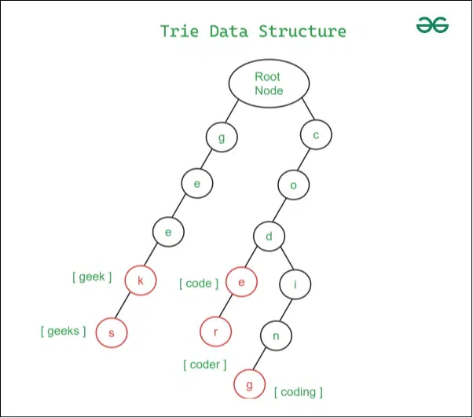

+++
title="数据结构：Trie"
date=2025-09-16
draft=false
[taxonomies]
tags=["algorithm", "cpp"]
+++

 Trie是一个可以快速检索字典的一种数据结构。本篇文章我们以存储英语单词，存储a-z的26个英语字母。
 ```cpp
 class TrieNode {
	 TrieNode* children[26];
	 bool leaf;
 };
 ```
 上面，
 - children[]： 大小为26的数组存储指针。由于我们是可以通过 `字母-'a'`的方式得到每一个字母的数值，因此字母可以和数组下标对应上。
 - leaf：标志是否是一个单词的结尾

> 图片来源于https://www.geeksforgeeks.org/

## Trie的基本操作
Trie最主要的操作有两个，插入和搜索。
### 插入
```cpp
void insert(string word){
	TrieNode* node = root;
	for(auto c : word) {
		int idx = c - 'a';
		if(!node->children[idx]) {
			node->children[idx] = new TrieNode();
		}
		node = node->children[idx];
	}
	node->leaf = true;
}
```
说明：
- idx就对应每一个字母
- 如果不存在，则创建一个新的节点
- 如果存在，那么沿着这个idx走下去
### 搜索
```cpp
bool search(string word) {
	TrieNode* node = root;
	for(auto c : word) {
		int idx = c - 'a';
		if(!node->children[idx]) {
			return false;
		}
		node = node->children[idx];
	}
	return node->leaf;
}
```
说明：
- 如果已经发现在查找的过程中某一个没有，那么直接返回false，标志没有找到
- 如果沿着这个单词都访问完了，分为两种情况，一种是`node->leaf=true`这个时候表明已经找到这个单词了。另一种情况是`node->leaf=false`，说明word并不是一个完整的单词，可能是每一个单词的前缀。如果需要找前缀，只需要改成`return true`即可。